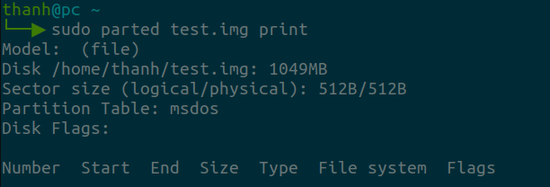
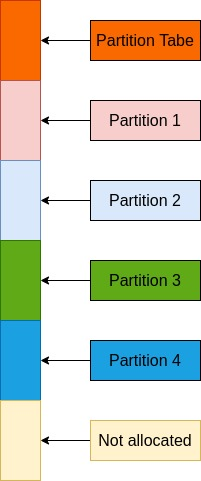
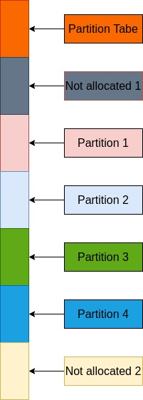

# Partition Table

{: .no_toc }

## Table of contents
{: .no_toc }

1. TOC
{:toc}

-----------------------------------
## Introduction

In the post [Esp8266 Partition Table](../embedded/esp8266/flash_map.md), I had mentioned about the partition table used on MCU, but it's a customized partition table designed by Espressif. There are standard partition tables used on Windows and Linux machines.

There are MBR and GPT partition tables and in this post I will put more detailed information about MBR partition table and how it was used on Embedded Linux System.

## MBR (Master Boot Record) and Partition Table Format

If we read the post [Tiny210:SD/MMC/eSSD Device Boot Block Assignment](https://thanhle.me/docs/uboot_kernel/2_tiny210/tiny210_information.html#sdmmcessd-device-boot-block-assignment), Block 0 of the storage device is reserved, the Second Boot Loader also knows as BL1 is flashed from block 1. The reason is that Block 0  is reserved to store the MBR, so we can split the SD card into multiple partitions to store data, rootfs ...

The master boot record (MBR) is a structure that holds the boot loader program (use on x86/x64 systems) and the partition table. The length of the MBR structure is 512 bytes.

|Offset (hex)|Size (in bytes)|Item|
|:-------------|:------------- |:---|
|0x0-0x1BD|446|Boot loader|
|0x1BE-0x1FD|64|Partition table|
|0x1FE-0x1FF|2|Signature (should be 0x55, 0xAA)|

To verify, we will create an virtual file and check the MBR

||Without MBR|With MBR|
|:-------------|:------------- |:---|
|Initialize image file|`dd if=/dev/zero of=test.img bs=1M count=0 seek=1000`|`dd if=/dev/zero of=test.img bs=1M count=0 seek=1000`|
|Create MBR||`parted -s test.img mklabel msdos`|

### Block 0 does not contain the MBR


### Block 0 contains the MBR

- Address<span style="color:#e39c09"> <b>0x0 to 0x1BD (446 bytes)</b></span> : boot loader (X86 instruction)
- Address<span style="color:#ed1bd7"> <b>0x1BE-0x1FD (64 bytes)</b></span> : partiton table
- Address<span style="color:#41fd16"> <b>0x1FE-0x1FF (2 bytes)</b></span> : contain MBR's signature, we can quickly read these 2 bytes to knows if the storage device have MBR or not.


Now check with `parted` utility, partition table is created, but there is no partition definition.



The partition table is an array of 4 partition table entries each of 16 bytes thus: 16x4 = 64.

The format of each partition table entry is the following:

|Offset|Size|Item|
|:-------------|:------------- |:---|
|0x00|1|Boot indicator; 0x80 = Active partition / 0x00 Inactive partition (boot_indicator)|
|0x01|1|partition start: head (chs_start.head)|
|0x02|1|partition start: sector (chs_start.sect)|
|0x03|1|partition start: cylinder (chs_start.cyl)|
|0x04|1|Partition ID (example ID=1 for FAT12) (system_indicator)|
|0x05|1|partition end: head (chs_end.head)|
|0x06|1|partition end: sector (chs_end.sector)|
|0x07|1|partition end: cylinder (chs_end.cyl)|
|0x08|4|Number of sectors before the beginning of this partition (sectors_before)|
|0x0C|4|Number of sectors in this partition (number_of_sectors)|

## Add partition into partition table

Since we have only 64 bytes for a partition table, and each partition record is 16 bytes, so in theory we can have maximum 4 partitions. So we may have an example of formatted device as below.

|Common partitions design|Partition design for embedded |
|:---|:---|
|Not design to store second bootloader and u-boot<br>|`Not allocated 1` is used to store second boot loader, u-boot<br>|

### Verified with `parted` tool

- Initialize image file

```
dd if=/dev/zero of=test.img bs=1M count=0 seek=1000
```

- Create MBR partition table

```
parted -s test.img mklabel msdos
```

- Create boot partition and mark it as bootable

```
parted -s test.img unit s mkpart primary fat32 32768 1081343
parted -s test.img set 1 boot on
```

- Create rootfs partition

```
parted -s test.img -- unit s mkpart primary ext2 1081344 -1s
```

- Verify partition

```
Disk /home/thanh/build/thanhle/ws/learns/mkfs_mmd_mcopy/test.img: 1049MB
Sector size (logical/physical): 512B/512B
Partition Table: msdos
Disk Flags:

Number  Start   End     Size   Type     File system  Flags
 1      16,8MB  554MB   537MB  primary               boot, lba
 2      554MB   1049MB  495MB  primary

```

Verify with gdisk

```
Disk test.img: 2048000 sectors, 1000.0 MiB
Sector size (logical): 512 bytes
Disk identifier (GUID): 08995E99-D816-4B73-B670-53E4147A7E83
Partition table holds up to 128 entries
Main partition table begins at sector 2 and ends at sector 33
First usable sector is 34, last usable sector is 2047966
Partitions will be aligned on 2048-sector boundaries
Total free space is 32734 sectors (16.0 MiB)

Number  Start (sector)    End (sector)  Size       Code  Name
   1           32768         1081343   512.0 MiB   0700  Microsoft basic data
   2         1081344         2047999   472.0 MiB   8300  Linux filesystem
```
